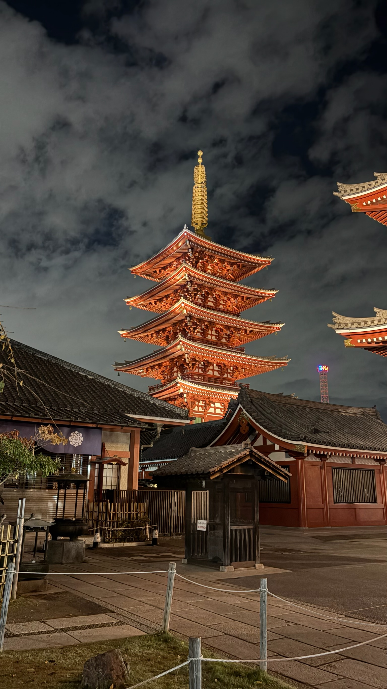
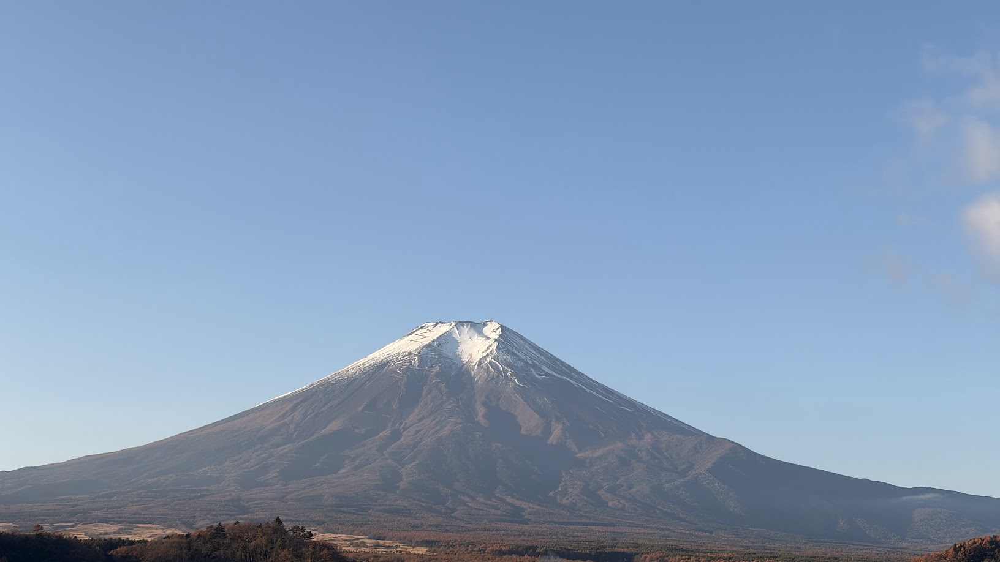
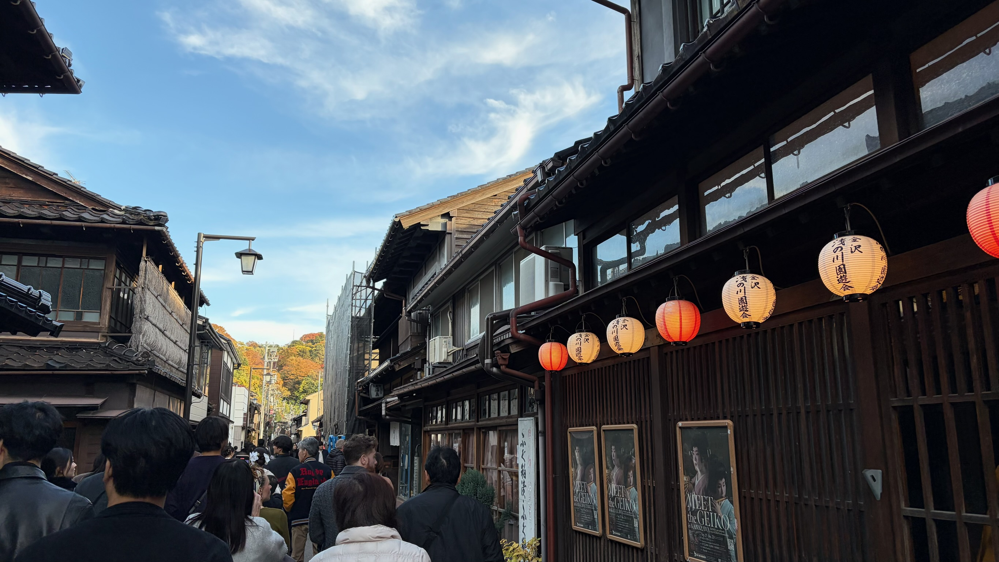
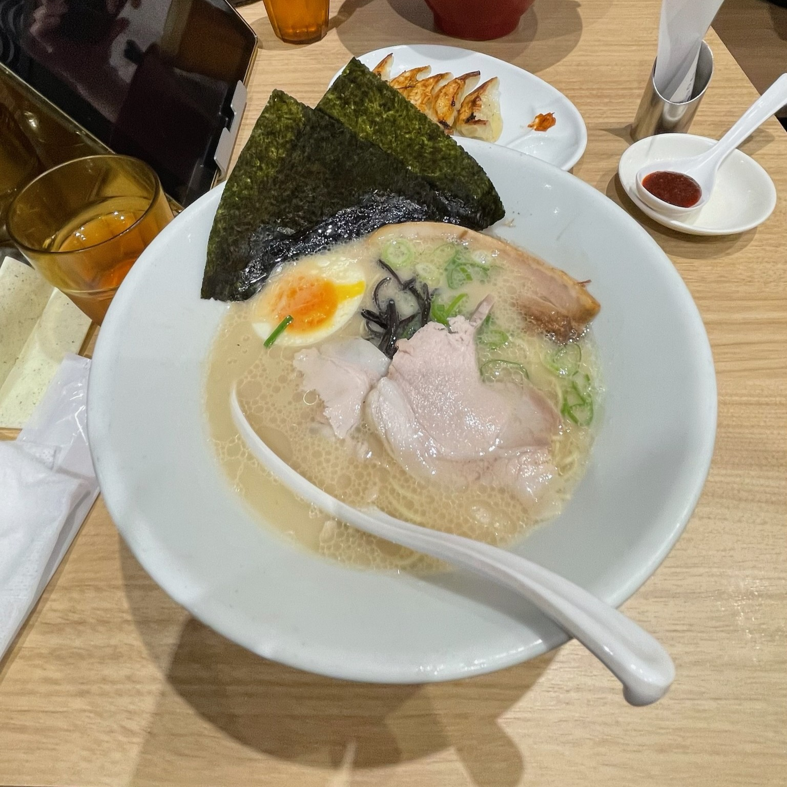

Welcome back lads and lasses to another year wrapped up and in the books. You know the drill by this point. I'm going to talk about some things I did this year, and hopefully you enjoy my ramblings and show-and-tells. I'm going to do things a bit differently this time and go month by month to talk about what I did in a given month. By this time next year, if I dislike this format, I'll go back to the regular list. Let's get started, shall we?

## January

- Spider-Man: Miles Morales
  - Terrific. Absolutely terrific. I'm also a big fan of, what I'm now deeming "short ass games". I'm in my 30s with a full time gig and a whole household to take care of, so what little time I have is very precious. I am a big fan of a game that packs in so much in so little time. I finished it in about 10 hours and felt like I ate a seven course meal.
- Ratchet and Clank: A Rift Apart
  - I have never played a Ratchet and Clank game before this one, and I absolutely adore this game. The voice acting is great, and the graphics on my new PS5 make this game look like a pixar movie. It's absolutely gorgeous. It's a fun little collect-a-thon with interesting battle mechanics that are kind of RPG-lite. It's well designed and completely worth checking out.
- 365 Days to the Wedding
  - Super cute. Well worth the watch, though it feels like it might venture into thriller territory, it's just a plot device.
- Fast Food Simulator
  - Really silly game to play with your friends. It's very quirky, but I think it has a lot of potential.

## February

- Final Fantasy 7 Remake
  - I played the demo for this initially in 2020 and just couldn't get into it. The new combat system along with the lack of turn based battles just really turned me off. I didn't get it. I revisited it this year and I'm really enjoying it. I think the story is a bit more obtuse, but I'm really enjoying the extra time they're giving for character development. It breathes new life into some characters that didn't really get as much screen time in the 1997 release.
- Shashingo
  - Very neat and fun way to learn some Japanese vocabulary.
- Noun Town (non-VR)
  - I very much like the vibe and atmosphere of this game. I think it has the potential to help you learn some vocabulary, but I just couldn't stick with it.
- Speed Crew
  - Basically Overcooked, but you're a car mechanic. It similarly has a giant difficulty spike, but it's not as intense as overcooked's one. It's a fun time with a friend or two.
- Apothecary Diaries Season 2
  - And so we continue down the rabbit hole of this story. It's just as compelling as season 1. Interesting new characters and stories.
- Spider-man 2
  - Incredible. Absolutely incredible. Super fun. Random emotional side stories that hit way too hard.

## March

- Monster Hunter Wilds
  - Definitely one of the most monster hunter games of all time. I dunno. I just couldn't get into this one the way I got into World or Rise. World was something really special. I was obsessed with World. Rise was fun, but I wasn't quite obsessed with it. Wilds is a nice mix of World and Rise, but outside of the massive upgrade in handlers, I just wasn't super invested in this one.
- I Have a Crush at Work
  - Super cute, classic work-place love story. It's a great time, and I am honestly more invested in the romance story happening to the side characters than the main characters
- Ranch simulator
  - Super jank sim game that's worth a laugh or two. I don't see myself playing it long term though.
- Abundance
  - Very interesting and eye opening book. I try not to be so cynical and pessimistic in every day life, and this book does a decent job of showing "what could be" if we, as a society, would get out of our own way. I learned a lot of some behind the scenes stuff from reading this. Why wasn't project warp speed talked about? It's absolutely incredible that we had that kind of collaboration to combat a global pandemic. I just wish we could do the same to solve other problems.

## April

- Forza Motorsport
  - Coming from games like Forza Horizon and Mario Kart, I was not prepared for this. This is a proper sim (when it's not crashing). The "always online" aspect is incredibly annoying, so I don't think I'd ever buy the game (I'm currently playing via game pass), but it's been a fun time despite the annoyances.
- Schedule 1
  - It's a decent time if you have enough people playing. Games like these stress me out due to all of the things you have to keep track of. Getting into trouble and running away is fun though. Really gets the blood pumping. The game also has a fun chase mechanic.

## May

- Kowloon Generic Romance
  - At no point in watching this did I know what would happen next. I'm honestly still a little lost. I was really hoping for a romance, but it never really happened, at least, the way you'd hope for. I still liked it even if it wasn't the thing I signed up for.
- Void Crew
  - It's kind of like "Lovers in a dangerous spacetime",  but 3D and it's not cute. Really fun if you can get a group of 4 or so to play together.
- The Headliners
  - Hilarious, but absolutely brutal game. It's fun for the first couple of hours, but it doesn't really have any staying power because there's no recourse if you lose everything. You have to be absolutely stupid and sacrifice yourself and/or a teammate to get a good enough score fairly early into the game. I think if they can tweak the difficulty on this one, it'd be a solid multiplayer experience, but right now, it's just not all the way there for me.
- Persona4 the Golden Animation
  - This one is hard to recommend to people that haven't play the games or haven't seen the first anime. It's supplementary material, but it's a nice time. It definitely hit the nostalgia bits for me, but its pacing is wild and can be disorienting.
- Guilty Gear Strive Dual Rulers
  - It's hard to recommend this to people that haven't played the games or know the lore. It assumes you know a lot. Having said that, as a fan of Guilty Gear, this was a fun watch. I always felt like the story mode of guilty gear would be better served as a movie or anime rather than...whatever the story mode is in the games (visual novel?)
- Nier Automata v1.1a Season 2
  - Strong finish to a terrific adaptation of the games. The YoRHa manga series has been a great read so far too. I don't feel like you need to have played the games to watch this, so that's saying a lot for a lot of other adaptations I've seen this year
- Aharen-san wa Hakarenai Season 2
  - SO FREAKIN CUTE. It's so silly, so zany, so over-the-top. If you have a low tolerance for "anime bs", then give this one a try, because I feel like I haven't seen much, if any. It's just purely silliness.

## June

- Lucky Loser
  - Interesting book by one of the hosts and correspondents of the Daily Show. There are bits in there I didn't really care for, but it's an interesting autobiography. I learned more about tennis than I was anticipating and I was re-affirmed in my decision to not follow the arts and stick with coding (I don't take criticism nor failure well).

## July

- Dandadan
  - Any time I see something popular, I like to give it a year or two to try out if I do decide to. Does it live up to the hype? I certainly think so. Season 2 was fantastic too. This anime has straight bangers that are in my daily rotation now.
- My Dress Up Darling Season 2
  - SUPER cute season and I really hope we can get more anime to finish out the manga. I'll definitely be picking back up the manga later this year.
- Tony Hawk Pro Skater 3+4
  - This was a nice trip down memory lane and looks how I remember it (more or less). I just wish Wish by Alien Ant Farm was still on the track list :( The game is more infuriating than I remember (was I really that good at the game as a kid? Did I forget this trauma? Did I rage just as much before? Who knows.) Tony Hawk was such a big part of my childhood. I'm glad they're giving these games a face lift for the current generation of gamers to enjoy. Here's to hoping we get Underground next (and please bring back the "put your face in the game" feature! That was the best!)
- PlateUp
  - This is basically overcooked in a slightly different format. It's just as stressful if not more. Don't recommend if you have crippling anxiety.
- R.E.P.O.
  - Terrific party game. It's very silly, yet challenging. If you go in for fun, I think you'll have a good time. It can get tense when trying to hide from baddies, but the goofy aesthetic helps to keep the mood light and carefree.
- WOWOWOW KORONE BOX
  - A really simple, free game that's great, especially if you're a fan of Korone. There's lots of references to her lore, and you can tell the developer put a lot of care into it, even if it is relatively simple gameplay wise.

## August

- Metal Gear Solid 2 (Master Collection)
  - This was my number one, favorite game of all time until I played Persona 5. I picked up the master collection on a whim because I had a Best Buy gift card and the game was on mega sale. I had a few moments one Sunday and decided to just boot up Metal Gear Solid 2 (my favorite). I immediately got absorbed into the game and the story and next thing ya know, it's 6pm and I've forgotten to do all of my Sunday chores. It's such a good game, and it's always been my favorite in the series.
- Battlefield 6 open beta
  - I was a huge fan of Battlefield 2, but I fell off of it by the time 3 came out. I picked up all of the ones since and played them a little bit, but they've never hit the same way 2 did for me. I really enjoyed the beta of 6 quite a bit. I wasn't put off by the weird colors that came with 3 and 4 (a la the Xbox 360/PS3 era grey and brown games). It's not that things were colorful, but I didn't feel like I had the "we're filming in mexico, so use the brown lens filter to make everything extra desert-y" sort of thing. Gameplay certainly felt more arcade-y than I'm used to (a la Call of Duty), but the squad based game play was still alive and well. I don't think I'm going to get the high's of Battlefield 2 from this one, but damn, is it close.
- Battlefield 2
  - I had to revisit this one after the Battlefield 6 beta. I really hope GOG can pull through and give us a good, updated and patched version of this game, because it was a hassle to get up and running with this one again. Luckily, PCGamingWiki pulls through, and with some terrific mod support, this game is a nostalgia pie that I completely devoured. I absolutely love this classic, and there will never be a battlefield game like it again.
- Whisper Mountain Outbreak
  - This one was interesting. I think the normal difficulty is a bit too hard for my tastes and sensibilities. The difficulty curve from the first map to the second looked like a straight line. I really wish you could save your progress to be picked up later too, but overall, I think this game has some good bones. It's definitely got potential. It's fun and interesting. It really feels like a "what if resident evil was a 2d isometric co-op experience?" kind of game. Definitely worth picking up, even at full price. Play with friends, though, you'll need it.
- Metal Gear Solid Delta: Snake Eater
  - A really solid remaster of the original. I was initially a bit skeptical of the character redesigns (if you want to call them that), but they grew on me. You know I had to go through and get all of the collectibles in the game because I needed that stealth for messing with the guards in my second playthrough. I think this is a really great entry point for newcomers to the Metal Gear franchise. Here's to hoping we get a proper remake of Metal Gear Solid 1 next.
- Battlefield 2042
  - It's okay. Nice co-op mode.
- Unreal Tournament
  - Just as great as you and I remember.
- PEAK
  - Very silly, but very hard. After a few playthroughs with friends, we were able to react The Peak ™️, but it was through blood, sweat, and tears, for sure.

## September

- Food for the Soul
  - It's such a cute little slice of life show. Nothing really happens, but I think that's part of why I enjoyed it as much as I did. It's just simple. It's comforting.
- Konosuba: God's blessing on this wonderful world!
  - I honestly didn't think I'd like this as much as I did. On paper, it has a lot of things that should hold it back, but it's executed so precisely that everything just works. Generally speaking, if I'm watching something by myself, I won't laugh out loud. I mean that in the literal sense where an actual laugh from the belly is expelled from my abdomen. However, this show had me absolutely roaring with laughter. My wife had to check on me a couple of times. This show kinda feels like if It's Always Sunny found its way into an isekai anime. You DO need a pretty good tolerance for anime bullshit for this one, but there's a lot here that's good if you can look past it. The prequel with Megumin is pretty good too, but I like this one a lot more.
- Cheese Rolling
  - A silly little game with a simple premise: roll down the hill and catch the cheese wheel. It's worth a download, and, it's free.

## October

- Konosuba: An explosion on this wonderful world!
  - This is the prequel to Konosuba that tells the story of Megumin before she joined the party. It's pretty good, though I don't like it as much as Konosuba. Megumin is my favorite character, so this was definitely a welcome addition to the story.
- Dungeon Defenders
  - Pretty solid tower defense game that came out a _long_ time ago. It's goofy, but it has its charm. I can't believe it's still being worked on and updated after 14 years.
- Spy Family Season 3
  - Season 3 keeps the hype train rolling with some absolutely fantastic episodes. We finally get an equivalent arc for Twilight/Loid in the same sort of way we got one for Yor in the previous season. Twilight/Loid's backstory is an incredible watch as well. I love what they're doing with the character development, and I'm excited to see where we go next season.
- Castlevania Nocturne Season 2
  - I binged this one. I think it's better than season 1, but I never felt for it what I felt for the original, especially the initial Dracula arc. This is still solid, though, and I think it's worth watching the whole series. It was a great show to start off the spookiest of all the months.
- May I Ask for One Final Thing?
  - This was a very nice and short anime that did everything it needed to do in 13 episodes. It was a fun time for sure. If you're into stories with tough, strong female leads, give this one a shot. I enjoy watching Scarlet beat the 💩 out of everyone she runs into.
- Hazbin Hotel
  - This one surprised me. I didn't think it'd sink its teeth into me the way it did, but I thoroughly enjoyed this, and I'm excited for season 2. I believe I've discovered something about myself. I really *_really_* enjoy religious lore. The stories of gods are human stories. The only difference between the high and mighty and us are just the magical things about them. I loved the story bits with Lucifer and Charlie because I think that strained parental relationship is so ubiquitous. The show being part musical was a pleasant surprise as well. I didn't know it was going to be like that going in. Season 2 came out while I was overseas, but I managed to watch every available episode. Season 2 has some pacing issues, but overall, we got a lot of good character development and music out of the deal.
- Konosuba audiobook/light novels (vol 7-10)
  - I have been obsessed with Konosuba since I started it. I didn't expect this story with its characters to have such a grip on me, but they have. The growth of this group of bumbling imbeciles is so charming and funny. I had to reach out for the light novels once I got done with the anime. Next stop will be the manga. I love this series so much!

## November

- Japan
  - Outside of watching a bit of Hazbin Hotel, this month was dedicated to my first trip to Japan. This trip took an incredible amount of planning. It's true what they say, though. Once you go there, you don't want to come back. I legitimately was in a panic at the airport before I was supposed to return to the US. I don't think I've ever had so much fun in my life. I loved every minute, and I'm actually planning on going back again next year. I might make a separate post on the trip at some point, because I found a lot of stuff that no one really tells you about, but I'll save that for January. For now, I'm going to finish up this post and enjoy the new year for a moment.

## December

- Konosuba audiobook/light novel (vol 11)
  - Of course, as soon as this released, I had to pick it up. The Komeko story arc was such a delight from start to finish. I love this wacky crew, and I'm excited to read/listen to the next volume when it releases next year.
- Guntouchables
  - Super hilarious and fun co-op game. The graphics and characters make this a joy to play.
- Marvel Cosmic Invasion
  - A couple of years ago, we had the privledge of playing Teenage Mutant Ninja Turtles: Shredder's Revenge. This year, the same folks brought us possibly the best marvel game of the past several years -- at least, multiplayer-wise. I like this one a bit less than shredder's revenge and streets of rage 4, but it's a great beat-em-up with great music and voice acting. This one is solid and worth picking up, especially if you're a fan of the beat-em-up genre like me.
- RV there yet?
  - This kind of game sits beside things like PEAK, R.E.P.O, and the rest. I heard a term the other day: "friendslop". There's a couple ways to interpret this. As someone that has dabbled in game dev, I strongly hesitate to use the word "slop" in most cases. I don't think this is "slop" in the way we think of "AI slop" or the stuff 14th century serfs would feed pigs. The other way to interpret this is "simple game with simple mechanics built for the sole purpose of socializing with a group of friends". In that case, I'm 100% on board. This game and its ilk don't demand a lot from you, so the emergent gameplay -- usually consisting of one straight man vs. 3 comedians -- is often organically funny. The game introduces a signature jank that you have to either work around, or use to your advantage to attack your straight man in order to get a laugh from your fellow comedians. For example, in this game, you have cables that can pull your RV out of a ditch if need be. You can use these cables to create enough tension so that the vehicle is slingshot forward at 1000 mph with your friends inside flying off into the distance. That's the kind of slop I enjoy.
- Deadzone Rogue
  - There are a ton of games like this out there. I think this is one of the good ones. It's a basic FPS roguelike/lite (I can never remember the difference) meant to be played with a couple of friends. I don't think this matches the "friendslop" category because it's not at all janky. It's a nice and polished experience that hits that little "numbers go up" dopamine receptor.
- Rock Band
  - I couldn't tell you exactly why, but I got the biggest itch to revisit this game this year. I think I just happened to hear a couple of the songs while listening to some stuff on shuffle, and a wave of 2008 nostalgia hit me. I know I didn't have any of the plastic guitars or drums anymore, but I did happen to find my original USB microphone for the PS2 version of the game. I plugged it in and had my own little karaoke session with my dog over Christmas break. I found out that the company CRKD makes replica guitars, so I decided to pick one up on a whim since I had an amazon gift card. I've since played through most of the songs, but man, I suck now. Though, I suppose I did mostly play the drums back then. Luckily, CRKD is going to release some replica drums in 2026, so you bet your butt I'm going to be getting one of those.

## Conclusion

This year, I decided to include some books/audiobooks I read/listened to. I enjoy audiobooks since I can consume them like I do music or a podcast. Just pop in the ol' earbuds and listen while doing dishes and other chores.

I learned a big lesson this year: _take a damn vacation_. I went to Japan in November, and while I was there, it hit me.

> _I haven't taken a vacation in 10 years_.

It's probably why I'm always exhausted. Whenever I take time off of work, I usually spend it at my house, doing everything I would normally do if I wasn't on vacation (chores, walking the dog, cooking, etc.) While I get a bit of a break from work, I still have the rest of my life to worry about, all the while thinking about all of the work I'm going to have to do once back to work. Going to Japan this year broke me of that routine. I spent my entire time thinking about having fun. At home, I'd be cleaning some bathrooms, cooking, doom-scrolling, or working. In Japan, my phone was only used for the map applications. In Japan, I was thinking about what kind of foods I want to try for the first time. In Japan, I was present. In some ways, I miss who I was while I was there. My anxieties of every day life melted away. I wasn't anxious at all. I was excited to learn how to ride the subway and how to get a shinkansen (bullet train) ticket. I'm not at all fluent in Japanese, but I knew enough to ask for directions, order food, and whatnot. It was fun and rewarding knowing that all of that time I've spent since 2020 studying wasn't wasted. I have a _loooooong_ way to go, as I can't hold a conversation or anything, but just getting to use a bit of すみません and ありがとうございます was exhilarating! I'll keep working, bit by bit, in 2026. Hopefully, in another 5 years or so, I can hold a bit of a conversation fully in Japanese.

As far as personal projects go, most of my time has been spent on the egg tracker project and this site. I have another thing in the works that's making me re-visit and re-learn C++ and Qt. I'm hoping to have that done in a few months (progress on anything for me is slow -- time is the most valuable commodity). I'll share that here whenever I'm able. Personal projects have to fight Japanese learning, calls with my mom, meal prep, among other things for time. I am _trying_ to be a bit gentler with myself on this. I'm not 15 anymore. I have a full time job, a mortgage, and a family I gotta worry about, and taking care of my family and friends is orders of magnitude more important to me than anything else.

Until next time, dear reader, I hope you have a terrific new year, and I hope 2026 is kind to you. Take care 👋

\- CJ

_Bonus pics from Japan!_

Sensoji Temple - Asakusa

Mt. Fuji

Kiyomizu-dera Temple - Kyoto

Kanazawa Station

Higashi Chaya District - Kanazawa

Ippudo Ramen - Tokyo

